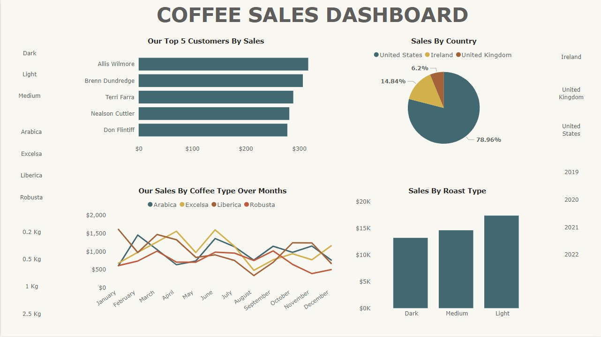

# 
 ☕**Coffee Sales Dashboard** ☕
  

## Overview 🚀
The **Coffee Sales Dashboard** provides a visual representation of key sales metrics related to coffee sales. It offers insights into customer purchases, sales trends by country, coffee type, and roast preferences.
   
### 
 Main Dashboard View

  
 
## Features 🔥  

### 📌 1. Top 5 Customers by Sales:
- Displays the highest-grossing customers.  
- Categorized by coffee type (Dark, Light, Medium, Arabica, Excelsa, Liberica, Robusta).  

### 🌎 2. Sales by Country:  
- Pie chart representation of sales distribution.  
- Countries included: United States, Ireland, United Kingdom.  
- Percentage breakdown of each country's contribution to total sales.  

### 📈 3. Sales by Coffee Type Over Months:  
- Line chart showing sales trends of different coffee types.  
- Coffee types: Arabica, Excelsa, Liberica, Robusta.  
- Monthly sales variations are tracked.  

### 🔥 4. Sales by Roast Type:  
- Bar chart comparing sales performance across different roast types.  
- Categories: Dark, Medium, Light.  
- Sales values are displayed in thousands (K) or millions (M).  

## Usage 🎯:  
- Track customer trends and identify high-value customers.  
- Understand the geographical distribution of coffee sales.  
- Analyze monthly sales fluctuations for different coffee types.  
- Optimize inventory and marketing based on roast popularity.  

## **Technologies Used** 🛠️:  
- Data Cleaning: **Excel**  
- Data Loading: **ETL**  
- Data Visualization: **Power BI**  

## 🙌 Special Thanks:  
This dashboard was inspired by a Youtube video by **MO Chen**, a talented Data Analyst and YouTuber! 🎥📊  

## 📩 Contact:  
For any questions or suggestions, feel free to reach out!  

